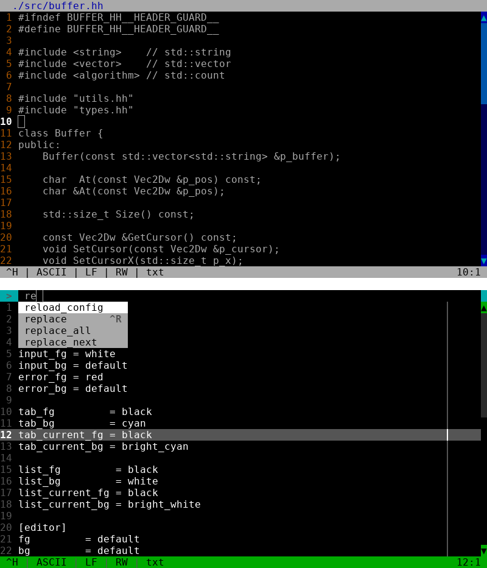

	<h1 align="center">Pona</h2>
	
Another terminal based text editor written in C++

	
	
	
	   
	

## Table of contents
* [Introduction](#introduction)
* [Features](#features)
* [Bugs](#bugs)
* [Dependencies](#dependencies)
* [Make](#make)

## Introduction
A [C++](https://en.wikipedia.org/wiki/C%2B%2B) [terminal](https://en.wikipedia.org/wiki/Terminal_emulator)
[text editor](https://en.wikipedia.org/wiki/Text_editor) for [Linux](https://en.wikipedia.org/wiki/Linux).
Unlike my other editor, [tr-ed](https://github.com/LordOfTrident/trident-editor), this aims to be simpler,
faster to use and atleast a bit more practical. For help on how to use the editor, press Ctrl+H while
in the editor.

## Features
- [X] Basic text editing
- [X] Scrolling (horizontal, vertical)
- [X] Ruler
- [X] Scrollbar
- [X] File i/o
- [X] Tabs
- [X] Config files
- [x] Themes
- [X] Command line
- [X] Mouse input
- [X] Selection
- [X] Copy/cut/paste
- [ ] Find and replace commands
- [ ] Build and run commands
- [ ] Syntax highlighting
- [ ] Lua plugins

## Bugs
If you find any bugs, please create an issue and report them.

## Dependencies
- [ncurses](https://en.wikipedia.org/wiki/Ncurses)
- [xclip](https://github.com/astrand/xclip)

## Make
Run `make all` to see all the make rules, `make` to compile a static binary.
